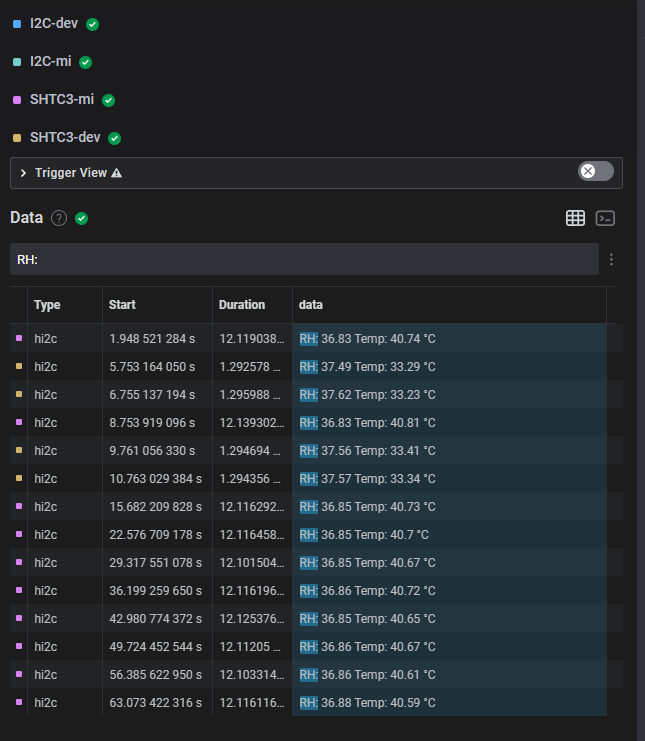

  # SHTC Transactions

Decodes I2C packets for SHTC3 temperature & humidity sensor with CRC

Example of two decodings: one reference and one device currently working on:

Notes here: 
- The I2C often fails to decode the I2C packets correctly, thus this analyser as it's based on it's decoding will fail decoding
- The decoding is done according to datasheet, section <b>5.11</b>